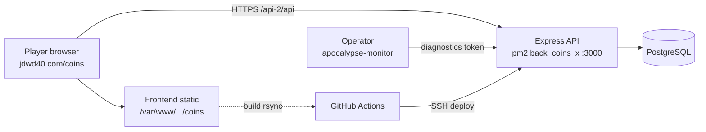
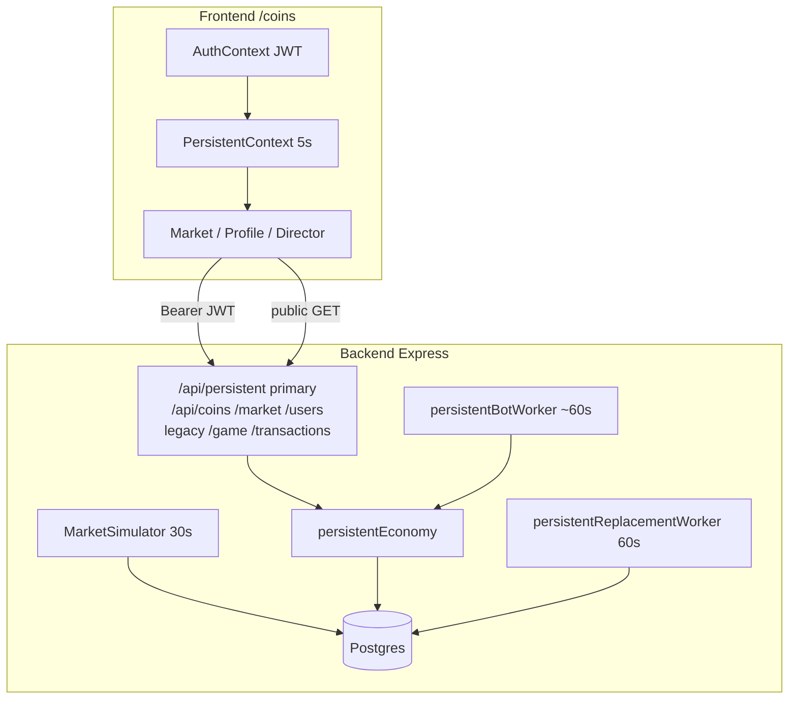
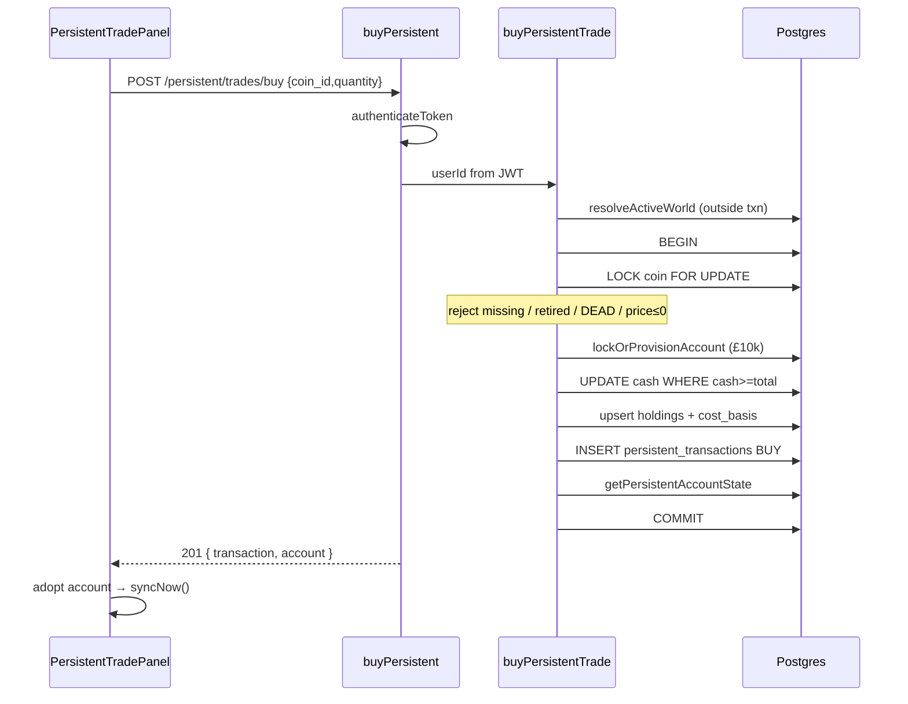
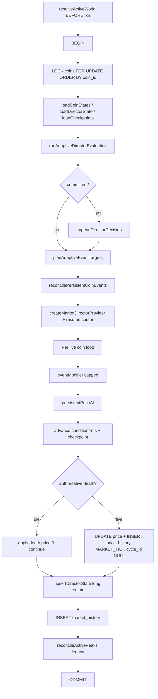
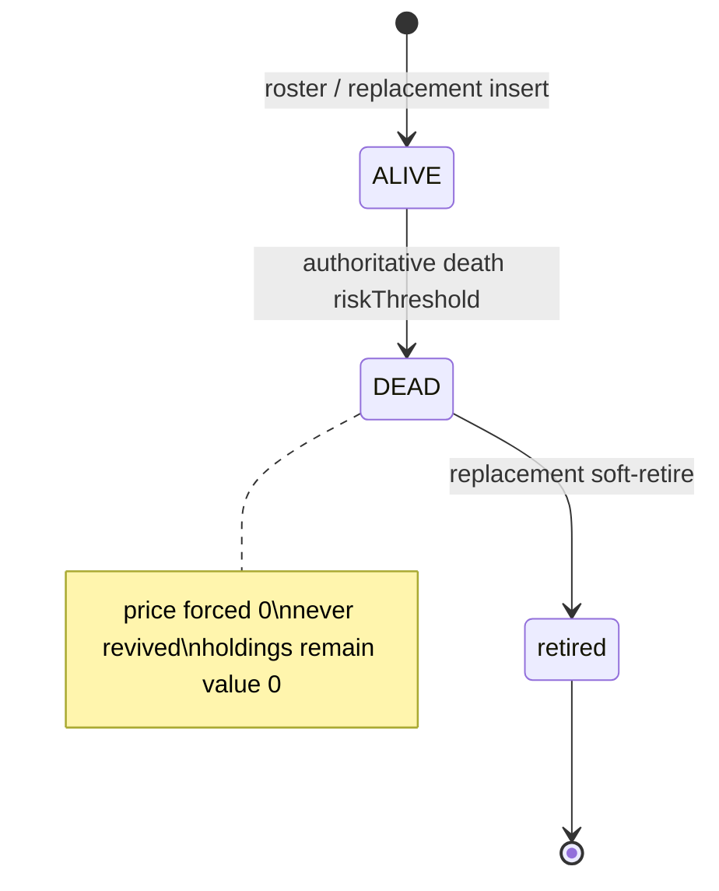
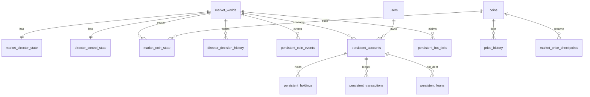
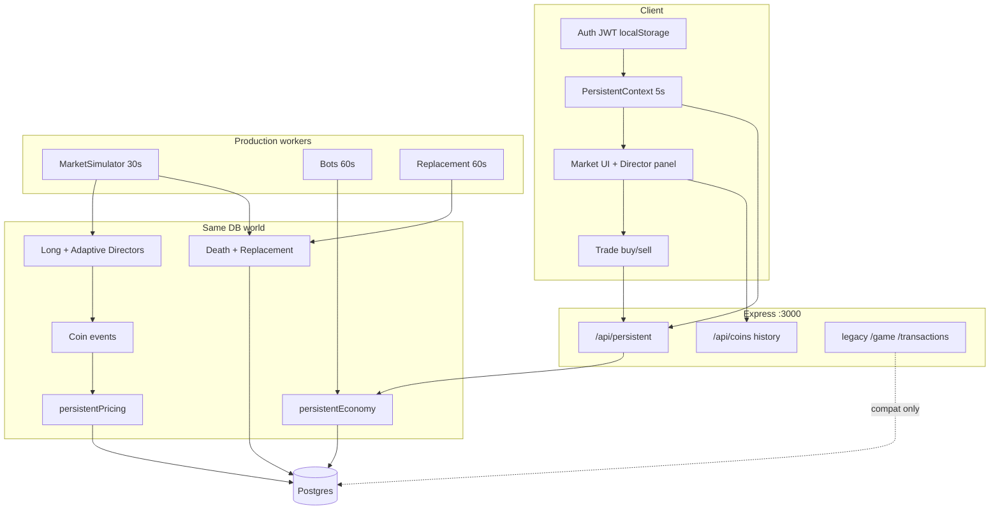

# Coins Software Architecture

**Current as of:** 12 September 2026 (Europe/London)  
**Backend SHA:** `4601dfa` (docs cleanup on top of runtime API `e69c019`)  
**Frontend SHA:** `012631e` (docs on `b755918`)  
**Production branches:** BE `main`, FE `master`  
**Live API:** https://jdwd40.com/api-2/api  
**Live UI:** https://jdwd40.com/coins/  

Authority: **code wins** when docs disagree. This report is assembled from verified backend/frontend architecture notes and project docs (`project_plan.md`, `PRD.md`, `README`, `API_DOCUMENTATION.md`, `docs/database_schema.md`, `changelog.md`, `bugs.md`). Where evidence is incomplete, items are marked **UNCERTAIN**.

---

## 1. Coins in One Page

Coins is a continuous **persistent market** game: players hold GBP cash and coin positions in a single active world, prices tick every **30 seconds** on the server, and wealth ranks on a live leaderboard.

| Layer | What it does |
|---|---|
| **Backend** (Express + Postgres) | Authoritative prices, JWT auth, persistent economy trades, Adaptive + long-running Directors, coin events, bots, replacements |
| **Frontend** (Vite/React, basename `/coins`) | Player shell with Auth → Toast → PersistentProvider; 5s poll of leaderboard/signals/runtime/account; trades `{coin_id, quantity}` |
| **Workers (production only)** | Market writer 30s; bot worker ~60s; replacement worker 60s |
| **Not primary anymore** | Apocalypse cycle game (`/api/game/*`, GameContext) — still mounted for compatibility / operator monitor |

**Starting cash:** £10,000 on persistent account provision (register best-effort; first buy also provisions).  
**Auth:** Bearer JWT, 24h expiry, stored in FE `localStorage` as `token` / `user`.  
**Open P1 bug:** `GET/PUT/DELETE /api/users/:user_id` JWT-authenticated but **no ownership check**.

---

## 2. System Context



- **UI host:** nginx static at `/var/www/jdwd40.com/html/coins` (rsync `dist/`).
- **API host:** VPS `213.165.91.221:4020` SSH; app at `/home/jd/back_coins_x`; listens `:3000`.
- **CORS:** `FRONTEND_URL` + localhost/5173–5175/etc.; credentials allowed.

---

## 3. Architecture at a Glance



**Dual Directors (same batch):**

1. **Long regime** — `GOLDEN_AGE|BOOM|BULL|BEAR|BUST|RECESSION` in `market_director_state` (hours-scale, seeded).
2. **Adaptive** — `NORMAL|BOOM|BUST|RESCUE` in `director_control_state` (~minutes, refractory ~20m); Golden/Demon roles; public via `/runtime` (summary codes only).

---

## 4. Repository Map

### Backend (`coins-arch-be` @ `4601dfa`)

| Path | Role |
|---|---|
| `server.js` | Bootstrap: JWT gate, DB ping, listen, prod workers, shutdown |
| `app.js` | Express, CORS, routes, prod `marketSimulator.start()` |
| `routes/` | HTTP mounts (`persistent`, `coins`, `market`, `users`, `game`, `transactions`, diagnostics) |
| `controllers/` | Thin handlers |
| `middleware/auth.middleware.js` | `authenticateToken` |
| `game/` | Persistent economy, directors, events, bots, replacement, pricing |
| `models/market-simulator.js` | 30s writer / `updateAllPrices` |
| `models/*.model.js` | DB access for state/history/users |
| `db/migrations/` | Canonical `007`–`032_*.sql`; baseline 001–006 |
| `db/migrate.js` | Migration runner |
| `__tests__/` | Jest serial suites |
| `.github/workflows/deploy.yml` | Deploy on `main` |
| `services/rollup-service.js` | **DEAD** (unimported) |
| `src/market/**` | Nest stubs **DEAD** |

### Frontend (notes @ `012631e`)

| Path | Role |
|---|---|
| `src/main.tsx` / `App.tsx` | Bootstrap; `basename="/coins"` |
| `src/context/AuthContext.tsx` | Login/register, localStorage |
| `src/context/PersistentContext.tsx` | 5s `allSettled` poll |
| `src/services/persistentService.ts` | Parsers + trade client |
| `src/services/apiConfig.ts` | Default API base |
| Player UI | `GameMarketGrid`, `PersistentDirectorPanel`, `PersistentTradePanel`, Profile |
| Internal | `/internal/apocalypse-monitor` |
| Leftover | `GameContext`, BuyForm/SellForm (unmounted) |

---

## 5. Backend Architecture

### Process lifecycle

1. `npm start` → `node server.js` (`package.json` `"main": "index.js"` is a **meta mismatch** — no `index.js`).
2. Production: require non-blank `JWT_SECRET` or exit.
3. DB ping → `app.listen(PORT\|\|3000)`.
4. **Production only after listen:** `persistentBotWorker.start()`, `persistentReplacementWorker.start()`.
5. **Production only in `app.js`:** `marketSimulator.start()` (30s ticks).
6. Legacy `gameCycleWorker` / `botWorker` / `economyWorker` are imported but **not started** in production.

### Route mounts (`app.js`)

| Mount | Router | Role |
|---|---|---|
| `/api/coins` | coinsRouter | Catalogue + price history |
| `/api/users` | usersRouter | Register/login/profile |
| `/api/transactions` | transactionsRouter | **Legacy** funds/portfolios |
| `/api/market` | marketRouter | status/stats/price-history |
| `/api/game` | gameRouter | **Legacy** cycle compat |
| `/api/persistent` | persistentRouter | **Primary** economy + signals/runtime |
| `/api/game/diagnostics` | gameDiagnosticsRouter | Token-gated; **404 if token unset** |

### Persistent API (primary)

| Method | Path | Auth |
|---|---|---|
| POST | `/trades/buy`, `/trades/sell` | JWT |
| GET | `/account`, `/transactions` | JWT |
| GET | `/leaderboard`, `/signals`, `/runtime` | public |

---

## 6. Frontend Architecture

- **Providers on player routes:** `AuthProvider` → `ToastProvider` → `PersistentProvider`. **`GameContext` is not mounted.**
- **Routes:** `/` Market, `/profile`, `/internal/apocalypse-monitor` (no player providers).
- **PersistentContext:** every **5s**, `Promise.allSettled` of leaderboard + signals + runtime + (account if authed).
- **Runtime stale:** `directorUnavailable` if last runtime success older than **15s**, or runtime null with error, or active world with null director.
- **Trade body:** `{ coin_id, quantity }` only — no client price.
- **Charts:** 5M UI range maps to **10M** API then client-window; sparklines from `/coins/:id/price-history`.
- **Dual surfaces on `/`:** primary persistent grid vs secondary `#markets` classic feeds (`useFetch` **2s** poll of `/coins`, `/market/stats`, `/market/status`).
- **Title debt:** `index.html` still “Apocalypse Exchange”.

---

## 7. Auth Sequence

```mermaid
sequenceDiagram
  participant U as User
  participant FE as AuthContext
  participant BE as /api/users
  participant PE as persistentEconomy

  U->>FE: Register
  FE->>BE: POST /register
  BE->>BE: createUser
  BE-->>PE: provisionPersistentAccount (best-effort)
  FE->>BE: POST /login (auto)
  BE-->>FE: { token, user? } JWT 24h
  FE->>FE: localStorage token + user

  U->>FE: Login
  FE->>BE: POST /login
  BE-->>FE: JWT
  Note over FE: getAuthToken validates exp;<br/>401 → SessionExpiredError → logout

  Note over BE: GET/PUT/DELETE /users/:user_id<br/>JWT ok but NO ownership check (P1)
```

---

## 8. Buy Sequence (Atomicity)



**Invariants:** server-locked price only; min notional £0.01; coins-before-account lock order; single-client txn.

---

## 9. Sell Sequence

Same auth/controller shape as buy. Differences:

| Step | Buy | Sell |
|---|---|---|
| Retired coin | **Rejected** | **Not checked** (code asymmetry — **UNCERTAIN** if intentional) |
| DEAD / price ≤0 | Rejected | Rejected |
| Holding lock | N/A | `persistent_holdings FOR UPDATE` |
| Cash | Debit with `cash >= total` | Credit `cash + total` |
| Cost basis | `+= total` | Proportionate reduce |
| Ledger | `BUY` | `SELL` |
| After death | N/A | Holdings remain, value £0, **unsellable** |

---

## 10. Market Simulation (Actual Order)

Cadence: **30s** (`priceUpdateInterval`); immediate tick on `start()`; on interval error recover in **5s**. Pricing state is **DB-backed** (checkpoints + director cursors); process memory holds only lifecycle flags + `lastBatch` for `/market/status`.



**Lock order:** coins first → world (inside adaptive upsert) → director/state/checkpoints. **Inverse order risks deadlock.**

---

## 11. Director

### Long-running (`game/marketDirector.js`)

- Regimes: `GOLDEN_AGE | BOOM | BULL | BEAR | BUST | RECESSION`
- Seeded deterministic walk; durations typically **hours**
- Persisted in `market_director_state`
- Public surface via signals: **regime + intensity only**

### Adaptive (`game/adaptiveDirector.js` + runtime)

- Modes: `NORMAL | BOOM | BUST | RESCUE`
- Evaluated **inside each 30s batch** (not a separate worker). Config `cadenceMs=1min` is a **validation lower bound**, not a timer.
- Windows often 8–14m NORMAL; interventions 2–10m; refractory ~**20m** (emergency 5m)
- Golden / Demon: at most one each, never same coin; Demon is a control signal, not a death sentence
- Persisted in `director_control_state` (+ mig 030/031 refractory fields)
- Audit: `director_decision_history` unique `(world_id, decision_index)`; public **summary codes only** (no seed/raw reason)

**Stale comment:** `simulationConfig` still says persistentEvents/directorControl “NOT wired” — **false**; Wave 3 writer wiring is live on main (`e69c019` + FE Wave4 panel).

---

## 12. Coin Events

| Aspect | Fact |
|---|---|
| Table | `persistent_coin_events` (mig 029) |
| Created | `reconcilePersistentCoinEvents` in same market batch txn |
| Duration | **1–15 minutes** |
| Max active | **5** per coin; net modifier capped (~0.06) |
| Apply | Same `eventModifier` once into price **and** condition advance |
| Public | `/api/persistent/runtime` per-coin events + net modifiers |
| Legacy | `apocalypse_coin_events` / `coinEventEngine` — cycle path only |

**Doc vs code:** `/market/status` events field is effectively **always empty** (writer comment) — secondary FE `#markets` CoinDetail still reads it; primary UI uses runtime events.

---

## 13. Bots

| Aspect | Fact |
|---|---|
| Worker | `persistentBotWorker` → `runPersistentBotTick` |
| Cadence | Default **60s** (`GAME_BOT_TICK_INTERVAL_MS` 1s–10m) |
| Idempotency | `persistent_bot_ticks` PK `(world_id, tick_id)`; `tickId = floor(now/interval)` |
| Roster | 4: conservative / momentum / dip_buyer / reckless |
| Economy | Same `buyPersistentTrade` / `sellPersistentTrade` (not HTTP) |
| Loans | Bot-only `persistent_loans`; humans debt=0 on leaderboard formula |
| Skip | No active world → skip |
| Legacy | `botWorker` **not started** in production |

---

## 14. Coin Lifecycle



- Death decided **after** living price calc via `decideAuthoritativePersistentDeath` (collapse-risk ≥ threshold — **not** living price floor alone).
- Replacement worker every 60s: `reconcilePersistentReplacements`; authored pool; **≤1** replacement per eligible death after delay (**6h** per plan/config).

---

## 15. Data ER



Also: `market_history`, `schema_migrations`. Legacy `apocalypse_*`, `portfolios`, `transactions`, `users.funds` remain for compat/monitor.

**Migrations:** runner executes **007–032** (`032_create_director_decision_history.sql`); 001–006 baseline; non-canonical SQL files not executed.

---

## 16. Sources of Truth Table

| Concept | Authority | Competing / legacy |
|---|---|---|
| Current price | `coins.current_price` (writer) | Legacy cycle/collapse paths price-neutral when world active |
| Player cash | `persistent_accounts.cash` | `users.funds`, apocalypse participant cash |
| Holdings | `persistent_holdings` | `portfolios`, `apocalypse_holdings` |
| Player charts | `price_history` where `source='MARKET_TICK' AND cycle_id IS NULL` | Cycle-scoped / null-provenance rows |
| Long Director | `market_director_state` | — |
| Adaptive Director | `director_control_state` | — |
| Events (player) | `persistent_coin_events` | `apocalypse_coin_events`; empty `/market/status` events |
| Bot wealth | Same accounts/holdings/debt | apocalypse bot tables |
| World | Single active `market_worlds` | Verifier fails closed |

---

## 17. Runtime Flows Map

| Flow | Trigger | Cadence | Entry |
|---|---|---|---|
| Market tick | Prod `marketSimulator.start` | 30s | `updateAllPrices` |
| Adaptive Director | Inside tick | Per batch / window endsAt | `runAdaptiveDirectorEvaluation` |
| Coin events | Inside tick | Per batch | `reconcilePersistentCoinEvents` |
| Bot tick | Prod bot worker | ~60s | `runPersistentBotTick` |
| Replacement | Prod replacement worker | 60s | `reconcilePersistentReplacements` |
| FE primary poll | PersistentContext | 5s | signals/runtime/leaderboard/account |
| FE classic secondary | `useFetch` on Market | 2s | `/coins`, `/market/stats`, `/market/status` |
| FE charts refresh | App `refreshTrigger` | 30s | secondary charts only |

---

## 18. Deployment

### Backend (`.github/workflows/deploy.yml`, push `main`)

1. SSH VPS → `cd /home/jd/back_coins_x`
2. `git fetch` + `reset --hard origin/main`
3. `npm install`
4. `NODE_ENV=production npm run migrate`
5. `verify:game-schema` + `verify:persistent-world`
6. `pm2 restart back_coins_x`
7. Health: `curl :3000/api/coins`
8. Signals: `/api/persistent/signals` requires `worldId` + `coins.length > 0`

Does **not** run `provision:persistent-world` on normal deploy.

### Frontend

1. `npm ci` → `test:ui` + `tsc --noEmit` → `build`
2. rsync `dist/` → `/var/www/jdwd40.com/html/coins`
3. curl live `/coins/`
4. **Does not run `test:unit`** in deploy

---

## 19. Testing

### Backend

- Jest `__tests__/` **serial** (`--runInBand`)
- Strong coverage: `persistent-economy-db`, `persistent-api`, `market-persistent-writer`, `adaptive-director*`, `persistent-coin-event*`, `persistent-bots`, `persistent-coin-death`, `persistent-replacement`, `persistent-runtime-api`, `deploy-workflow`, `verify-persistent-world`, `price-history-provenance`
- Many leftover **cycle-era** suites still run

### Frontend

- `test:unit` — parsers, gates, chart sanitize, sync-gate, etc.
- `test:ui` — source contract (~1260 lines): PersistentProvider only, trade body shape, single timer, Wave4 panel, no hard-coded host outside `apiConfig`
- Deploy gates on UI contract + tsc + build only

---

## 20. Strengths

- Clear **primary** persistent path separated from legacy mounts
- **Atomic** buy/sell with server-locked prices and coins-before-account locking
- Deterministic seeded Directors + event identity → reproducible simulation
- Bot tick claims prevent double-trading across processes
- Price history **provenance** filters protect player charts from Apocalypse data
- Deploy verifies schema + live world signals before declaring healthy
- FE sync-gate prevents stale account apply across logout/user switch
- Strong Jest / UI-contract coverage on hot paths

---

## 21. Risks / Debt

### Immediate

- **P1 IDOR:** authenticated profile routes lack ownership check (`bugs.md`)
- Auth FE default fabricated `funds: 1000` vs £10k persistent narrative
- Dual event models: primary runtime vs secondary `/market/status` (empty events)

### Maintainability

- Stale `simulationConfig` “NOT wired” comments; README FE table omits Wave4 director panel
- `package.json` `main: index.js` vs `server.js`
- Classic 2s vs persistent 5s polls on same page
- FE deploy skips `test:unit`
- `project_plan` once said Wave4 runtime not deployed — **now it is** on main

### Legacy

- Mounted `/api/game/*`, `/api/transactions/*`, unmounted GameContext / BuyForm / SellForm
- Writer still calls `reconcileActivePeaks` (compat)
- Registration still best-effort `joinRound`
- Dead `rollup-service`, Nest `src/market`

### Acceptable

- Apocalypse monitor kept as internal operator tool
- Compatibility exports retained until Stage-style contract retirement
- Single-pm2 writer assumption (multi-instance **UNCERTAIN**)

---

## 22. Glossary

| Term | Meaning |
|---|---|
| Persistent world | Single active `market_worlds` row; continuous market |
| MARKET_TICK + null cycle | Persistent price history provenance |
| Long Director | Hours-scale regime chain |
| Adaptive Director | Short mode/roles/events inside writer batch |
| Golden / Demon | Adaptive spotlight roles (not death) |
| eventModifier | Capped net active event effect on price/condition |
| Provision | Create `persistent_accounts` with £10k |
| Authoritative death | Irreversible DEAD + price 0 |
| Replacement | Authored new coin after death delay |
| PlayerShell | Auth+Toast+Persistent providers |
| SessionExpiredError | FE 401 handler → logout |
| Refractory | ~20m cooldown after adaptive intervention |

---

## 23. How It All Fits Together



**Bottom line:** players interact only with the persistent economy and runtime/signals surfaces; a single production writer batch advances prices, directors, and events under a strict lock order; bots and replacements share that world; legacy Apocalypse code remains mounted but is not the production gameplay path as of **12 Sep 2026**.

---

*End of human architecture report. SHAs BE `4601dfa` / FE `012631e`.*
